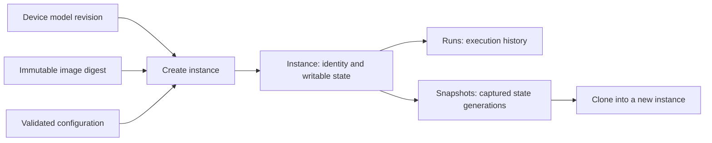

# Proposed domain model

Status: proposed architecture from 2026-09-21. This is a design record, not
the current API or manifest contract. See [instance configuration](operations/config-documents.md)
and [image storage](image-store.md) for implemented behavior. The related
[migration design](migration/rust.md) is also historical.

The three primary objects are **device model**, **image**, and **instance**.
Execution is represented separately by a **run**.

| Object | Question it answers | Examples | Ownership |
| --- | --- | --- | --- |
| Device model | What hardware can we emulate? | UDM Pro, U6+, a configurable x86 PC | Versioned hardware definition, constraints, defaults, supported peripherals and engine requirements |
| Image | What initial software/state can this machine boot? | Prepared UDM firmware release, Windows analysis baseline | Immutable manifest, named local components, compatibility requirements and provenance |
| Instance | Which particular machine is mine? | `gateway-lab-01`, `analysis-42` | Stable identity, resolved configuration and all writable machine state |
| Run | What happened during this execution? | The current execution of `gateway-lab-01` | Exact launch plan, process identity, endpoints, helper processes, logs and execution outcome |

## Device model

Use `DeviceModel` and `device_model_id` in code and contracts. The UI can say
"Devices" for the model catalog, but a created machine is always an instance.
Host USB devices and emulated peripherals are attachments/components, not entries
in that top-level model catalog.

A model describes an architecture, board/machine type, hardware constraints,
configurable resources, storage/firmware slots, supported peripherals and engine
requirements. Each published revision is immutable. It contains neither an
installed software version nor an individual machine's serial number or state.

The QEMU machine string is an implementation mapping, not the public model ID.
A generic PC model may support several CPU/memory/peripheral configurations;
"malware analysis" is a use-case preset, not intrinsically a hardware model.

A model revision can pin an exact QEMU version and an exact engine-bundle digest
when a particular patched build is required. Upstream version, QEMU machine
type/version and bundle identity are separate constraints. Resolve and persist
the selected bundle in the instance configuration; restarts never silently select
a newer or system QEMU. Missing pins make launch unavailable. Different models
can use installed bundles side by side. Changing a published pin requires a new
model revision, and applying it to an existing instance is explicit stopped-state
reconfiguration with compatibility validation.

A project or user-local model binding may also pin an explicit QEMU executable
path, including an unreleased checkout build. Project-relative paths resolve from
the project root. Keep host paths out of portable published model manifests;
record the resolved path, executable digest, reported version and required
dependencies locally. Verify declared model constraints and detect replaced
binaries before launch. Accepting a rebuilt executable is explicit; a path alone
does not provide the reproducibility of an immutable engine bundle.

Declared hardware support is distinct from availability: a model can support
USB attachment while operator policy or the current host makes it unavailable.

Models may expose dedicated typed hardware configuration, such as analysis CPU
topology, SMBIOS, ACPI, PCI/device descriptors and sensors. A reusable hardware
configuration profile supplies values, including explicitly imported output from
`analysis-profile`; it is neither an image nor a lifecycle owner. Resolve model
defaults, preset defaults, the selected hardware profile and instance overrides
in that order, then validate against model/image/engine constraints and operator
policy. Save the effective values and profile provenance in the instance's
configuration revision. Source-file edits do not silently alter existing machines.
Profiles work in global and project workspaces; reusable descriptions remain
separate from each instance's persistent UUID/MAC/serial identity.

## Image

An image is an immutable, versioned boot baseline. It can contain several named
components: disk, kernel, initramfs, firmware code, initial firmware variables,
flash partitions, or initial TPM state when explicitly supported. It is not
necessarily one disk file.

Each component declares its role and initialization behavior: read-only use,
copy into instance state, or writable overlay over an immutable backing file.
Components are stored as named local files with SHA-256 verification metadata.
The image manifest itself has a digest; a human-readable name/tag resolves to
that digest before instance creation.

An image declares compatibility with model revisions/configurations. Architecture
alone is insufficient: board layout, boot method, storage interfaces and firmware
requirements may matter. A prepared appliance image may target one model; an OS
baseline may work on multiple compatible configurations.

An upstream firmware download is an input artifact. A preparation recipe produces
an image manifest and verified components from it. An advertised image whose
restricted components have not been imported remains unavailable for creation.

Publishing a new image revision never silently changes existing instances.

## Instance

An instance is a durable machine created from a compatible model revision and
image digest, plus validated configuration. It owns:

- Its ID, name, creation provenance and model/image references.
- Its resolved desired configuration and revision, including permitted overrides.
- Its persistent guest identity: UUID, MAC addresses, serials and applicable
  board-specific identity data.
- Its writable disks, NVRAM, flash, EEPROM and TPM state, as applicable.

An instance exists while stopped and before its first run. State may be
materialized lazily, but it has an instance owner from creation onward. Each
instance has at most one active run, including starting, paused and stopping
states. Start, restore, clone and destructive state operations share the same
instance exclusion boundary.

Stopping preserves state. Starting again preserves identity. A guest reboot does
not recreate the instance. Reset-to-image is a separate destructive operation
with an explicit policy for identity and firmware/TPM state. Changing the recorded
image reference is not an implementation of upgrade or reset.

Desired configuration and the last run's realized configuration are distinct;
configuration changes must not rewrite historical launch evidence.

## Run and lifecycle

Use "run" as the domain term to avoid confusing execution with a browser login
or viewer connection. Replace the existing `/sessions` API with run resources;
do not retain compatibility aliases.

Each new process launch creates a new run ID. A guest reset or pause/resume keeps
the same run. A process restart ends one run and begins another. Reconnecting an
API or supervisor to a verified surviving process preserves its run ID.

A run records the exact engine build digest, resolved configuration revision,
launch inputs and process identity. Sockets, input leases and viewers belong to
the run. Logs and reports are associated with it but can outlive its ephemeral
runtime directory under the configured retention policy.

Instances expose effective status derived from their active run; they do not
maintain a competing independent `running` flag. Process liveness and guest
execution state must agree with one authoritative lifecycle owner.

## Relationships and operations

Snapshots capture a coherent generation of all declared persistent state and the
configuration/identity information needed to restore it. Start with stopped-only
disk/device-state snapshots. Live snapshots and RAM capture require a separate,
explicitly supported contract. Restoration preserves the original instance ID
and cannot proceed while a run owns its writable state.

A clone creates a new instance from an immutable captured generation. It must
never use another instance's live writable disk as backing storage. Give clones
a new instance ID and normally a new guest identity. Exact-identity duplication
is a separate explicit mode; changing identity or TPM state may invalidate
guest enrollment or sealed secrets and requires a coherent model/image policy.

Publishing an instance snapshot as a reusable image is an explicit export step,
including decisions about machine-specific identity and secrets. A private
snapshot is not automatically a distributable image.

Shared image components and snapshot backing generations cannot be deleted while
referenced. Deleting a run never deletes the instance; deleting an instance does
not delete shared images. Artifact retention is handled explicitly.

## Supporting vocabulary, kept small

| Term | Meaning |
| --- | --- |
| Blob/asset | Immutable bytes identified by digest; a storage primitive, not a machine |
| Profile/preset | Convenience input selecting a model, optional image and default configuration; resolved at creation, not another lifecycle owner |
| Preparation recipe | Transforms supplied firmware/software into a verified image |
| Engine build | Immutable emulator/tool bundle capable of realizing supported models |
| Attachment | A peripheral or external resource bound to an instance configuration or a particular run |

Operator policy remains authoritative over preset defaults. Runtime host paths,
credentials, sockets and allocated resources are resolved separately from
portable model/image metadata.

The intended future flow is: **choose a device model → select a compatible
image → configure and create an instance → start/stop it → inspect its runs**.
The current CLI uses optional profiles as creation templates and saves each
instance's resolved configuration in its own JSON/YAML document.
